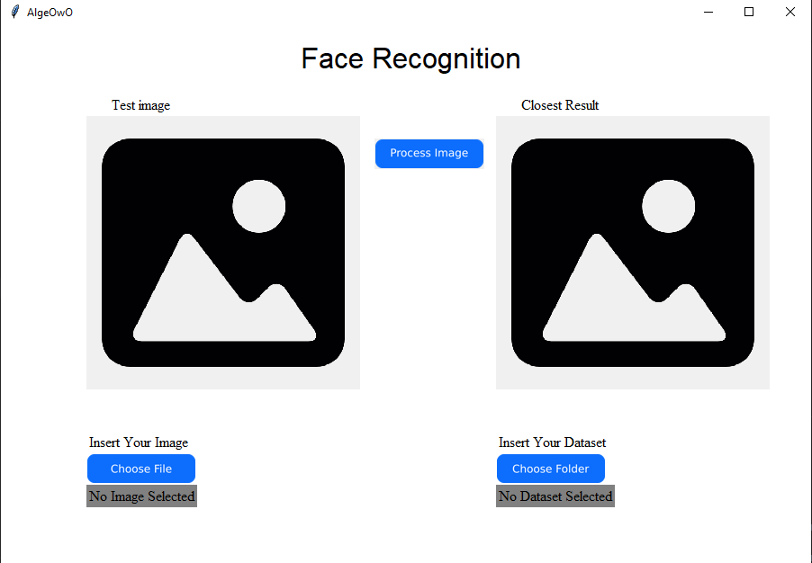

# Aplikasi Pengenalan Wajah Algeo02-21042

> Aplikasi pengenalan wajah yang menganalisis wajah seseorang dari sekelompok dataset. Aplikasi ini dibuat sebagai pemenuhan Tugas Besar 2 mata kuliah Aljabar Linear dan Geometri IF2123.

## Table Of Contents
* [General Information](#general-information)
* [Technologies Used](#technologies-used)
* [Features](#features)
* [Screenshots](#screenshots)
* [Setup](#setup)
* [Usage](#penggunaan)
* [Project Status](#status-project)
* [Room for Improvement](#room-for-improvement)
* [Group Members](#group-members)
* [Program Structures](#program-structures)

## General Information
- Aplikasi ini adalah aplikasi yang dapat mencocokkan satu foto wajah seseorang dengan foto orang-orang yang terdapat di dalam dataset.
- Aplikasi ini merupakan penerapan nilai eigen dan vektor eigen ke dunia nyata dengan menggunakan bahasa pemrograman python.

## Technologies Used
Python 3.9.6

## Features
Fitur dalam aplikasi ini adalah:
- Fitur pengenalan wajah

## Screenshots


## Setup
Prerequirement
- Python: https://www.python.org/downloads/

## Usage
`python -u interface.py`

## Status Project
Project is: no longer worked on (completed)

## Room for Improvement
1. Meningkatakan akurasi program
2. Meningkatkan efisiensi waktu berjalannya program

## Group Members

| NIM        | Names                                     | Task Distribution              |
| -----------| ----------------------------------------- |--------------------------------|
| 13521042   | Kevin John Wesley Hutabarat               | Algoritma Eigenface            |
| 13521073   | Ezra Maringan Christian Mastra Hutagaol   | GUI                            |
| 13521083   | Moch Sofyan Firdaus                       | Nilai dan vektor eigen         |

## Program Structures
```
|-  README.md
|-  .gitignore
|
|- src
|    |- eigen.py
|    |- imgprocess.py
|    |- pencocokan.py
|    |- interface.py
|- test
|    |- dataset
|- doc
     |- Algeo02-21042.pdf
```

